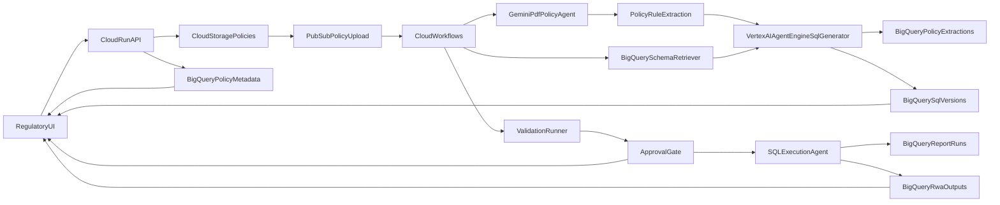
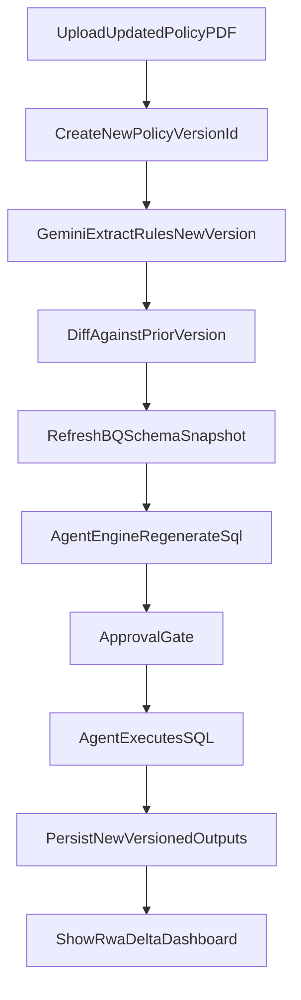

# Product Requirements + Architecture (Google Native)

## 1) Product Vision

Build a Google-native regulatory reporting platform for Global Finance and Treasury that converts internal RWA policy PDFs into versioned, auditable SQL logic and report outputs. The platform must support policy updates, SQL regeneration, reproducible report versions, and full lineage from policy document to final regulatory dataset.

## 2) Business Context and Scope

- Audience: Global Finance Leadership + Treasury teams responsible for global regulatory reporting.
- Data domain: Aggregated exposures, positions, mappings, risk parameters, and reporting totals (no individual customer analytics).
- Primary objective: Reduce policy interpretation cycle time while improving transparency, control, and auditability.

### In Scope

- Ingest internal policy PDFs and store references using BigQuery `OBJECT_REF`.
- Agentic extraction of policy rules and non-deterministic SQL generation using Vertex AI Agent Engine.
- Agent-executed versioned SQL to produce RWA reporting tables.
- Policy update workflow that regenerates SQL and creates a new report version.
- End-to-end lineage linking policy/version/sql/run/result.
- UI for upload, review, approval, execution, diff, and audit trace.

### Out of Scope (Phase 1)

- Non-Google-cloud data stores.
- Customer-level servicing workflows.
- Real-time intraday regulatory submissions (batch near-real-time accepted).

## 3) Product Requirements (PRD)

### 3.1 Personas

- Regulatory Reporting Lead: owns policy interpretation and final sign-off.
- Treasury Analyst: validates portfolio-level impacts and reconciliations.
- Data Steward: ensures data quality, mapping completeness, and lineage.
- Platform Admin: controls access, approvals, release policies.

### 3.2 Core User Journeys

1. Upload baseline policy PDF and register as a new policy version.
2. Trigger “Interpret Policy” to produce structured rule extraction + draft SQL.
3. Review and approve SQL, then an agent executes the SQL and persists a new report run.
4. View output tables and business KPI totals with policy linkage.
5. Upload updated policy PDF; auto-diff prior policy rules and SQL.
6. Run new version and compare RWA deltas versus prior approved version.
7. Export audit package: policy refs, rule diff, SQL versions, run metadata.

### 3.3 Functional Requirements

- `FR-1` Policy ingestion:
  - Accept PDF uploads via UI.
  - Persist raw file in Cloud Storage; store metadata and `OBJECT_REF` in BigQuery.
- `FR-2` Policy identity/versioning:
  - Generate immutable `policy_id` and monotonic `policy_version_id`.
  - Track status (`draft`, `extracted`, `approved`, `superseded`).
- `FR-3` Agentic policy understanding:
  - Parse PDF content with Gemini and extract calculational rules, thresholds, mappings, and exclusions.
  - Produce structured JSON rule model and human-readable summary.
- `FR-4` SQL generation and validation:
  - Generate BigQuery SQL via Vertex AI Agent Engine implementing extracted rules.
  - Ground SQL generation using both policy-derived structure and live BigQuery metadata (`INFORMATION_SCHEMA`, table schemas, and column types).
  - Deterministic SQL templates are not allowed for final generation; agent output must be policy/rule-driven.
  - Run static checks and reconciliation templates before approval.
- `FR-5` Report materialization:
  - An approved, policy-generated SQL is executed by the agent, and outputs are persisted in versioned tables.
  - Stamp each output row/set with `policy_id`, `policy_version_id`, `sql_version_id`, `run_id`.
- `FR-6` Update workflow:
  - Ingest revised PDF, diff extracted rules vs prior version.
  - Generate updated SQL and create new output version without overwriting history.
- `FR-7` Lineage and audit:
  - Provide queryable lineage graph from policy document to report output.
  - Retain artifacts for audits and reproducibility.
- `FR-8` UI/UX:
  - Single UI for upload, extraction review, SQL review, approvals, run execution, diff, and lineage.

### 3.4 Non-Functional Requirements

- `NFR-1` Security: IAM least privilege, CMEK where required, VPC-SC optional.
- `NFR-2` Compliance: immutable run metadata and approval history.
- `NFR-3` Reliability: idempotent workflow steps with retry and dead-letter handling.
- `NFR-4` Performance: policy-to-draft SQL under agreed SLA (e.g., <10 min typical).
- `NFR-5` Observability: centralized logs, traces, metrics, and run health dashboards.
- `NFR-6` Explainability: preserve evidence of extracted clauses to generated SQL sections.
- `NFR-7` Agent grounding: every generated SQL version must include trace artifacts (policy clauses used + BQ schema snapshot used at generation time).

### 3.5 Success Metrics

- 50–70% reduction in time from policy update to validated SQL.
- 100% of report outputs linked to policy/sql/run IDs.
- <2% manual remediation rate after first production quarter.
- Audit package generation in <5 minutes per run.

### 3.6 Risks and Mitigations

- Extraction ambiguity from legal language -> human approval gates + clause citation.
- SQL drift/logic errors -> test harness + reconciliations + canary comparisons.
- Policy version confusion -> strict semantic versioning and supersede workflow.

## 4) Reference Architecture (Google Native, OBJECT_REF-centric)

## 4.1 Core Services

- Cloud Run: hosts the UI backend/API and orchestration endpoints.
- Cloud Storage: canonical storage for uploaded policy PDFs.
- BigQuery:
  - Metadata, lineage, version registries.
  - `OBJECT_REF` columns to reference policy artifacts.
  - Source financial datasets, generated SQL artifacts, and final report tables.
- Vertex AI (Gemini on Vertex): agentic extraction + SQL generation with prompt templates.
- Vertex AI Agent Engine: orchestrates tools for policy retrieval, rule extraction, schema retrieval, SQL generation, SQL self-check, and rationale output.
- Gemini direct PDF understanding from GCS object: primary policy parsing method for this demo.
- Cloud Workflows: orchestrates ingestion -> extraction -> validation -> execution -> publish.
- Pub/Sub: event trigger for new policy uploads and async step decoupling.
- Cloud Functions or Cloud Run Jobs: lightweight workers for transformation/diff tasks.
- Dataplex + Data Catalog: governance, glossary, lineage enrichment.
- Cloud Logging + Monitoring: operational telemetry and alerting.
- Secret Manager + KMS: secrets and encryption controls.

## 4.2 BigQuery Data Model (minimum)

- `policy_documents`
  - `policy_id STRING`
  - `policy_version_id STRING`
  - `uploaded_at TIMESTAMP`
  - `uploaded_by STRING`
  - `policy_object_ref OBJECT_REF` (points to PDF in GCS)
  - `status STRING`
  - `supersedes_policy_version_id STRING`
- `policy_extractions`
  - `policy_version_id STRING`
  - `extraction_json JSON`
  - `clause_citations JSON`
  - `model_version STRING`
  - `created_at TIMESTAMP`
- `policy_sql_versions`
  - `sql_version_id STRING`
  - `policy_version_id STRING`
  - `generated_sql STRING`
  - `agent_trace JSON`
  - `schema_snapshot JSON`
  - `validation_status STRING`
  - `approved_by STRING`
  - `approved_at TIMESTAMP`
- `report_runs`
  - `run_id STRING`
  - `policy_id STRING`
  - `policy_version_id STRING`
  - `sql_version_id STRING`
  - `run_status STRING`
  - `started_at TIMESTAMP`
  - `ended_at TIMESTAMP`
- `rwa_report_outputs`
  - business output columns (portfolio/bucket/metric)
  - `run_id STRING`
  - `policy_id STRING`
  - `policy_version_id STRING`
  - `sql_version_id STRING`
  - `as_of_date DATE`

## 4.3 End-to-End Flow

## 4.4 Policy Update + Versioning Flow

## 5) UI Product Definition

- Policy Inbox: list policy IDs, versions, status, owner, upload time.
- Policy Viewer: PDF preview + extracted clauses + confidence/citations.
- SQL Studio (controlled): generated SQL, side-by-side with prior version diff.
- Run Console: execute/report run, show job status, validation checks, row counts.
- Impact & Diff Dashboard: prior vs new policy version RWA delta analysis.
- Audit Explorer: lineage from output -> run -> SQL -> extraction -> policy `OBJECT_REF`.

## 6) Security and Governance Controls

- IAM role separation: uploader, reviewer, approver, executor, auditor.
- Row/column security in BigQuery for sensitive financial dimensions.
- Artifact immutability for approved versions.
- Signed approval events and tamper-evident audit logs.

## 7) Implementation Roadmap

- Phase 1 (MVP): ingestion, object_ref metadata, extraction, SQL generation, manual approval, versioned output.
- Phase 2: automated diff quality gates, reconciliation library, richer lineage dashboards.
- Phase 3: policy simulation sandbox, stress-scenario overlays, release automation.

## 8) Demo Narrative (Leadership Workshop)

- Act 1: Upload baseline policy -> generate SQL -> run report -> show traceability.
- Act 2: Upload updated policy -> SQL auto-update -> run new version -> show delta impact.
- Act 3: Open audit explorer to prove policy-to-output lineage and governance controls.
